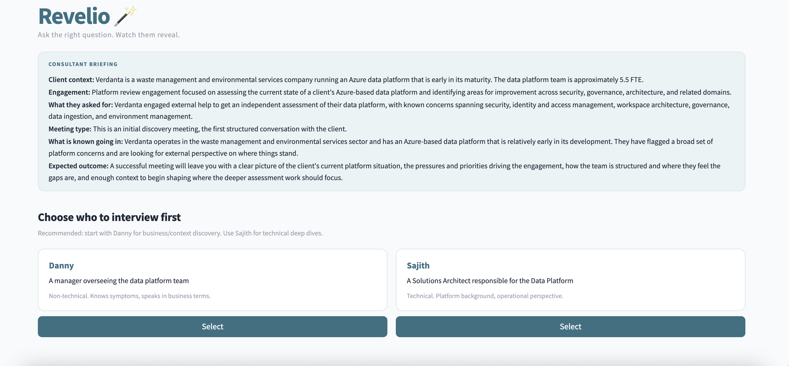
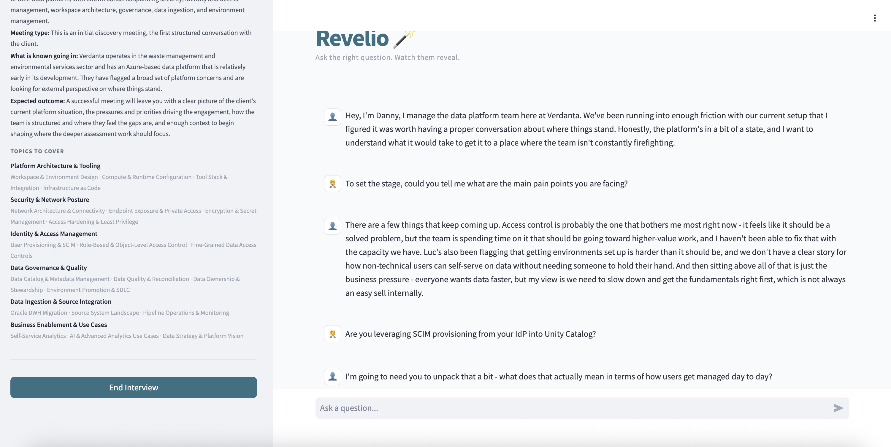
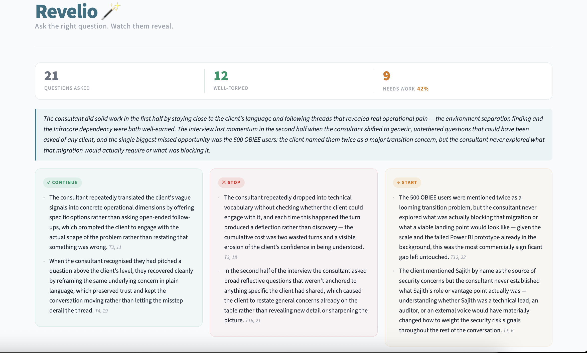
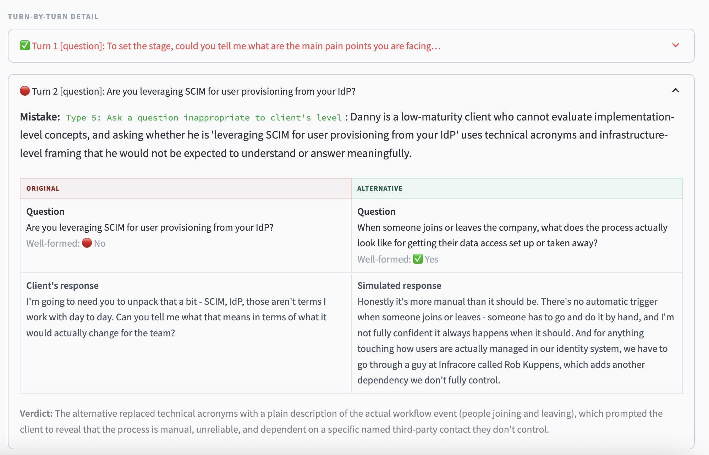

# Revelio — Synthetic Client Training System

An AI-powered interview simulator that lets consultants practice requirements elicitation against realistic synthetic clients, then evaluates their performance turn-by-turn and generates structured coaching feedback.

Built as a master's thesis project at [Revodata](https://revodata.nl) (Databricks consulting, Amsterdam). The system addresses a real business problem: requirements gathering, not technical implementation, is the primary bottleneck in consulting engagements, yet there is no structured way to train for it.

---

## Demo

**1. Briefing and persona selection.** Each scenario can expose several stakeholders with different roles and maturity levels; the consultant picks who to interview and gets an engagement briefing up front.



**2. The interview.** A multi-turn conversation with the synthetic client. The client answers only what's asked and reveals facts progressively — here it deflects an over-technical question instead of volunteering information, exactly as a real low-maturity stakeholder would.



**3. The coaching report.** After the interview, headline stats plus *Continue / Stop / Start* feedback, each point tied to specific turns.



**4. Turn-by-turn counterfactuals.** For each flawed question the system generates a stronger alternative, simulates how the client *would have* responded to it, and explains why it works — a counterfactual, not just a critique.



---

## The Problem

Consultants enter client meetings with deep technical expertise but zero knowledge of the client's organization, maturity level, or political dynamics. They have to discover all of this through conversation. Current training is informal shadowing: unscalable, inconsistent, and with no feedback mechanism.

The core challenge is that clients often can't articulate what they need. A consultant who asks "what are your access control requirements?" gets a blank stare. A consultant who asks "when a new analyst joins, what happens? Who sets up their access, and how long does it take?" gets a story that reveals three governance gaps.

This system lets consultants practice that skill in a controlled environment with immediate, structured feedback.

---

## What the System Does

**1. Simulated Interview.** The consultant conducts a multi-turn conversation with a synthetic client (an AI persona grounded in real, anonymized engagement materials). The client behaves like a real stakeholder: answers what's asked, doesn't volunteer information, and requires progressively specific questions to reveal deeper knowledge.

**2. Knowledge Gating.** This is the architectural core of the system. The client LLM physically cannot reveal facts it hasn't been shown. Scenario knowledge is split into two tiers: character knowledge (contextual background, retrieved fresh each turn) and discovery items (specific facts gated behind retrieval). Retrieval is embedding-based using Voyage AI — no LLM call per turn. This is structural exclusion, not prompt-based suppression.

**3. Turn-Level Evaluation.** After the interview, each consultant question is classified against 7 mistake types (Category A: Follow-up Mistakes — Types 1–3; Category B: Question Framing Mistakes — Types 4–7). The evaluator sees only the question and prior context, never the client's response, to prevent outcome bias. At most one mistake is returned per turn — the single most fundamental root cause. The evaluator prompt is calibrated with 7 practitioner-annotated worked examples (few-shot), drawn from the held-out gold set so strictness matches how expert consultants actually judge these turns.

**4. Counterfactual Alternatives.** For every flawed question, the system generates an improved version (with a retry loop that feeds back evaluation failures), runs it through the same conversation graph, and shows what the client *would have* said. This answers both "what should I have asked?" and "why would it have been better?"

**5. Coaching Report.** A structured feedback report with three sections: *Continue* (effective techniques used), *Stop* (behavior patterns that caused problems, evidenced by alternatives working better), and *Start* (gaps evident from avoidance patterns or missed threads). Includes a one-sentence improvement verdict per alternative.

**6. Multi-Persona Scenarios.** A scenario file can define multiple stakeholder personas (e.g. a platform manager and a solutions architect). The consultant selects who to interview. Each persona has its own character knowledge, discovery items, and maturity level.

**7. Scenario Generator Pipeline.** A multi-phase LLM pipeline that produces scenario files from raw engagement notes or scratch — extracting facts, classifying them into character knowledge vs. discovery items, generating narratives, validating inference paths, and assembling the final file. Human reviews intermediate outputs between phases.

---

## Architecture

```
┌─────────────────────────────────────────────────────┐
│                  CONVERSATION GRAPH                  │
│                  (LangGraph, 2 nodes)                │
│                                                      │
│   Human message ──► Retrieval Node ──► Client Node   │
│                     (no-op pass-     (Voyage embed.  │
│                      through)         + Claude Sonnet)│
│                                            │          │
│                                     Responds using    │
│                                     only revealed     │
│                                     facts             │
└─────────────────────────────────────────────────────┘
                          │
                    Interview ends
                          ▼
┌─────────────────────────────────────────────────────┐
│                 EVALUATION GRAPH                     │
│                 (LangGraph, 3 nodes)                 │
│                                                      │
│   Turn Evaluator ──► Alternative ──► Report          │
│   (Haiku classify    Simulator       Generator       │
│    Sonnet evaluate)  (generate →     (Continue /     │
│                       verify →        Stop / Start)  │
│                       simulate)                      │
└─────────────────────────────────────────────────────┘
```

Two separate LangGraph state machines with distinct lifecycles. The conversation graph is lightweight and runs per-turn. The evaluation graph is a one-shot batch job that processes the full transcript after the interview ends.

### Retrieval System

Retrieval is embedding-based (Voyage AI `voyage-3.5-lite`, cosine similarity). No LLM call per turn.

Two cheap rule-based pre-filters run before any embedding call:
1. **Structural check**: does the input contain a verb or question word? Bare noun phrases fail immediately.
2. **Intent check**: is it a genuine question, not a reaction or catch-all? Blocks acknowledgments and topic-reference patterns.

If both pass, retrieval queries two separate embedding indices:
- **CK index** (threshold 0.45): returns up to 5 character knowledge paragraphs as topical context. Retrieved fresh every turn — not persisted.
- **DI index** (threshold 0.55): returns up to 3 discovery items that pass the threshold and have not already been revealed. These persist in state once unlocked.

A context-aware retry prepends the preceding exchange when the question is referential or incomplete (subject-position pronoun, follow-up openers, ≤4 words).

### Key Design Decisions

- **Structural gating over behavioral prompting.** The client LLM cannot leak what it cannot see. Prompt-based suppression rules are unreliable when the model has access to the information.
- **Embedding retrieval, not LLM gate.** Semantic matching via Voyage embeddings is deterministic, inspectable (scores logged), and removes per-turn LLM cost. Pre-filters stay as cheap Python checks.
- **Two-tier knowledge injection.** CK items provide contextual background retrieved fresh each turn; DI items are stateful disclosures that persist once revealed. Keeping these separate prevents a consultant gaining permanent "credit" for background context.
- **Evaluator outcome isolation.** The client's response is hidden from the evaluator so question quality is judged independently of what it happened to unlock.
- **Counterfactual simulation reuses the conversation graph.** The alternative question runs through the identical retrieval + client pipeline, ensuring a fair comparison.
- **Statistics computed in Python, not by LLMs.** Turn counts and mistake frequencies are pre-computed and passed to the report LLM as hard facts. This removes a known failure mode where LLMs miscount from long annotation lists.
- **Single mistake per turn.** Multiple mistake types appearing simultaneously are treated as symptoms of the same underlying problem; only the most fundamental root cause is returned.
- **Few-shot calibration from expert annotations.** The evaluator prompt embeds worked examples sourced only from turns where two practitioners independently agreed, with held-out test turns excluded (including from exemplar prior context). The evaluator's agreement with human annotators and run-to-run stability are measured offline in `evals/` rather than assumed.

---

## Tech Stack

| Layer | Technology | Role |
|---|---|---|
| Orchestration | **LangGraph** | State machines for conversation and evaluation pipelines |
| Client Simulation | **Claude Sonnet 4.6** (temp 0.7) | Synthetic client persona with natural language variation |
| Turn Evaluation | **Claude Sonnet 4.6** (temp 0.0) | Mistake classification against 7-type taxonomy |
| Turn Classification | **Claude Haiku 4.5** (temp 0.0) | Cheap routing: question / statement / other |
| Alternative Generation | **Claude Sonnet 4.6** (temp 0.3) | Improved question generation with retry loop |
| Report Generation | **Claude Sonnet 4.6** (temp 0.3) | Structured coaching feedback synthesis |
| Scenario Generator | **Claude Opus 4.6** | Narrative generation, validation, review passes |
| Retrieval | **Voyage AI** (`voyage-3.5-lite`) | Embedding-based CK + DI retrieval (cosine similarity) |
| Similarity Compute | **numpy** | In-memory dot product on normalized embeddings |
| UI | **Streamlit** | Conversation interface, evaluation display, session log download |
| Deployment | **Databricks Apps** | Production deployment at Revodata |
| Framework | **LangChain** | LLM abstraction and prompt management |

Temperature is set intentionally per task: high for natural client responses, zero for deterministic evaluation, low for constrained generation.

---

## Project Structure

```
agent_v2/
├── main.py                  # Terminal conversation loop
├── streamlit_app.py         # Streamlit UI (persona selection, sidebar, evaluation, session log download)
├── graph.py                 # Conversation LangGraph; builds embedding indices once per session
├── eval_graph.py            # Evaluation LangGraph construction
├── client.py                # retrieval_node (no-op), client_node (embedding retrieval + prompt + LLM)
├── knowledge.py             # Scenario parser; EmbeddingStore; structural/intent/needs_context checks
├── state.py                 # ConversationState TypedDict (messages, revealed_items, retrieval_traces)
├── evaluation_state.py      # EvaluationState TypedDict
├── evaluator_core.py        # Shared MISTAKE_TYPES, format_transcript, evaluate_turn (Sonnet 4.6)
├── turn_evaluator.py        # Node 1: per-turn mistake classification
├── alternative_simulator.py # Node 2: alternative generation (Sonnet 4.6) + Stage C comparison
├── report_generator.py      # Node 3: feedback report synthesis (Sonnet 4.6)
├── session_logger.py        # Saves session JSON (partial per-turn + full post-eval); local or Databricks Files API
├── paths.py                 # Deployment-safe path resolution; SESSION_LOG_DIR from env
├── app.yaml                 # Databricks Apps deployment config (env vars, secret refs)
├── run_embedding_test.py    # Debug script: embedding retrieval with scoring logs (threshold calibration)
├── replay_session.py        # Replay a saved session log in the Streamlit UI (evaluation phase, no LLM calls)
├── docs/
│   ├── behavior_rules.md            # Generic client behavior rules (loaded by client.py at runtime)
│   ├── mistake_types.md             # 7-type mistake taxonomy
│   ├── architecture.md              # System design rationale (thesis documentation)
│   └── scenarios/
│       └── waste_management.md      # Multi-persona scenario (Danny + Sajith)
├── scenario_generator/              # LLM pipeline for generating scenario files from engagement notes
│   ├── pipeline.py                  # Orchestrator: run_from_notes(), run_from_scratch(), resume(), combine_personas()
│   ├── config.py                    # Shared config, llm_call(), I/O helpers, MATURITY_LEVELS
│   ├── cli.py                       # CLI entry point (python -m scenario_generator.cli)
│   ├── phase0_generate.py           # Generate scenario from parameters (no source notes)
│   ├── phase1_extract.py            # Extract structured facts from engagement notes
│   ├── phase2_anonymize.py          # Anonymize identifying information
│   ├── phase3_classify.py           # Classify facts into CK/DI/drop; taxonomy generation
│   ├── phase3_5_completeness.py     # Completeness check + gap-fill
│   ├── phase4_narrate.py            # Generate character knowledge narrative (Opus)
│   ├── phase5_validate.py           # Inference path validation with autofix loop (Opus)
│   ├── phase6_assemble.py           # Per-persona assembly + multi-persona combine
│   └── phase7_review.py             # Dedup, revalidation, retag, review checklist
├── tests/
│   └── test_embedding_retrieval.py  # Unit + smoke tests: pre-filters, EmbeddingStore, retrieve_relevant_knowledge
├── evals/                           # Offline evaluation harness (thesis Chapter 7); not used at runtime
│   ├── gold_set_manifest.json       # 42-turn gold set: researcher key + turn source
│   ├── annotation_sheet_*.xlsx      # Expert annotator sheets (Paul, Joost, domain expert)
│   ├── stability_test.py            # Evaluator self-consistency across N runs per gold-set turn
│   ├── evaluation_analysis.py       # Normalisation, train/test split, Cohen's kappa, zero-shot accuracy
│   ├── fewshot_comparison.py        # Zero-shot vs few-shot evaluator comparison (28-turn held-out set)
│   └── path_a_fewshot_package.json  # Source of the EVAL_PROMPT worked examples
├── figures/
│   └── figure_specs_v1.md           # Thesis figure specifications
└── requirements.txt
```

---

## Getting Started

**Runs fully locally — no Databricks account required.** You only need two API keys (Anthropic + Voyage). Session logs are written to a local `logs/` directory by default; the Databricks integration is optional and only used for the hosted deployment. No Docker needed.

### Prerequisites

- Python 3.10+
- Anthropic API key (Claude Sonnet + Haiku access)
- Voyage AI API key (embedding retrieval)

### Installation

```bash
git clone https://github.com/mananbhatia/requirements-elicitation-agent.git
cd requirements-elicitation-agent
pip install -r requirements.txt
```

### Configuration

Copy the example env file and fill in your two keys:

```bash
cp .env.example .env
```

```env
ANTHROPIC_API_KEY=your-anthropic-key
VOYAGE_API_KEY=your-voyage-key

# Optional: override default embedding model (default: voyage-3.5-lite)
# EMBEDDING_MODEL=voyage-3.5-lite

# Optional — hosted deployment only: write session logs to a Databricks
# Unity Catalog Volume instead of local logs/. Leave unset to run locally.
# DATABRICKS_TOKEN=your-token
# DATABRICKS_BASE_URL=https://your-workspace.azuredatabricks.net
# SESSION_LOG_DIR=/Volumes/your-catalog/default/logs/sessions
```

### Running

**Streamlit UI** (recommended):
```bash
streamlit run streamlit_app.py
```

**Terminal mode**:
```bash
python main.py                                        # Default scenario
python main.py docs/scenarios/waste_management.md     # Specific scenario
```

**Tests**:
```bash
python -m pytest tests/                                                          # All tests
python -m pytest tests/test_embedding_retrieval.py -v -k "not smoke"            # Unit tests (no API key needed)
python run_embedding_test.py                                                     # Embedding smoke test with scoring logs
```

### Creating New Scenarios

Scenario files are self-contained Markdown documents. Two formats are supported:

- **Legacy format** (single persona, flat `##` sections): `Identity`, `Maturity Level`, `Team Members`, `Personality`, `Company Overview`, `Character Knowledge`, `What the Client Can Articulate`, `What the Client Knows But Won't Volunteer`.
- **Multi-persona format** (generated by `scenario_generator/`): `## Persona: {name}` blocks with `###` subsections including `### Character Knowledge` (parsed into retrievable chunks) and `### Discovery Items` (with explicit `[DI-XX]` IDs).

See `docs/scenarios/waste_management.md` for the multi-persona format. The architecture is scenario-agnostic: swapping clients requires no code changes.

To generate a new scenario from engagement notes using the pipeline:

```python
from scenario_generator.pipeline import run_from_notes

run_from_notes(
    notes_path='scenario_generator/notes/engagement.txt',
    scenario_name='my_scenario',
    interview_stage='initial_discovery',
    personas=[
        {'name': 'Danny', 'role': 'manager of the data platform team', 'maturity': 'LOW'},
        {'name': 'Sajith', 'role': 'Solutions Architect for the Data Platform', 'maturity': 'MEDIUM_HIGH'},
    ],
)
```

---

## Research Context

This project is the artifact of a Design Science Research master's thesis (JADS, 2025-2026). The problem was validated through 19 semi-structured interviews with 8 practitioners. The system design is grounded in 5 meta-requirements and 8 design principles derived from practitioner evidence and academic literature.

Key academic foundations:
- **Shen et al. (2025)**: Mistake taxonomy for evaluating requirements elicitation interview quality
- **Lojo et al. (2025), C-LEIA**: Validated LLM-based client simulation for interview training (120 students, 85% preferred AI client over static materials)
- **Jin et al. (2025), ReqElicitGym**: Oracle User design principles for simulated clients (Groundedness, Passive Response, Context Awareness)

### Evaluator Validation

The LLM-as-judge evaluator is validated empirically rather than assumed correct (thesis Chapter 7). Two practitioners independently annotated a 42-turn gold set; agreement between them is measured with Cohen's kappa (bootstrap 95% CIs). The gold set is split into a 14-turn few-shot pool and a 28-turn held-out test set (fixed seed). Evaluator quality is measured against that test set on two axes: run-to-run **stability** (majority label over repeated runs) and **agreement with the human annotators**, comparing the zero-shot evaluator against the few-shot evaluator (exact McNemar tests). The full reproducible analysis lives in `evals/`.

---

## Future Work

Built and validated: knowledge gating, embedding retrieval, the 7-type mistake evaluator with few-shot calibration and empirical validation, counterfactual alternatives, the coaching report, multi-persona scenarios, and the scenario-generator pipeline. Not yet built:

- **Topic coverage tracking** — which subtopics were covered vs. missed across a session (the taxonomy exists in scenario files but coverage is not yet computed or displayed).
- **Interaction strategy** — whether the consultant only asked questions or also proposed solutions.
- **Adaptability** — whether the consultant adapted to the client's knowledge level over the course of the interview.
- **Retrieval logic revisit** — the retrieval gate currently serves conversation flow only; the matching logic is a candidate for future refinement.

---

## License

Released under the [MIT License](LICENSE). Developed as part of a master's thesis internship at Revodata; scenario content is based on anonymized engagement material.
